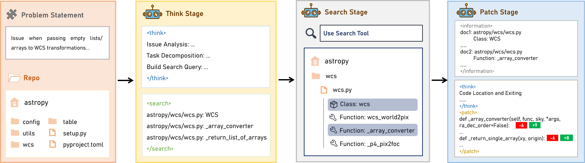
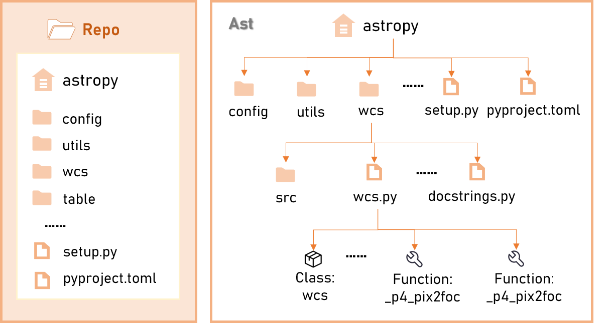

# Think-Search-Patch (TSP): A Retrieval-Augmented Reasoning Framework for Repository-Level Code Repair

## Table of Contents

- [Overview](#overview)
- [Framework Architecture](#framework-architecture)
- [Key Features](#key-features)
- [Installation](#installation)
- [Project Structure](#project-structure)
- [Quick Start](#quick-start)
- [Usage](#usage)
- [License](#license)

## Overview

Think-Search-Patch (TSP) is a retrieval-augmented reasoning framework designed for repository-level code repair. This framework combines advanced retrieval techniques with reasoning capabilities to provide effective solutions for code repair tasks at the repository level.

## Framework Architecture

### TSP Framework Overview


### Index Construction Pipeline


## Key Features

- **Retrieval-Augmented Reasoning**: Combines retrieval mechanisms with reasoning capabilities
- **Repository-Level Understanding**: Handles code repair at the repository scale
- **Information Masking**: Advanced information masking techniques in both training frameworks
- **Comprehensive Evaluation**: Search reward calculation and LLM-judge evaluation methods
- **Modular Architecture**: Well-organized components for easy development and deployment

## Installation

### Prerequisites
- Python 3.9+
- CUDA-compatible GPU (recommended)

### Install Required Frameworks

```bash

# Install SFT training framework
cd verl && pip install -e .
cd ..

# Install DPO training framework
cd OpenRLHF && pip install -e .
cd ..

# Install index construction framework
cd SWE-bench && pip install -e .
cd ..
